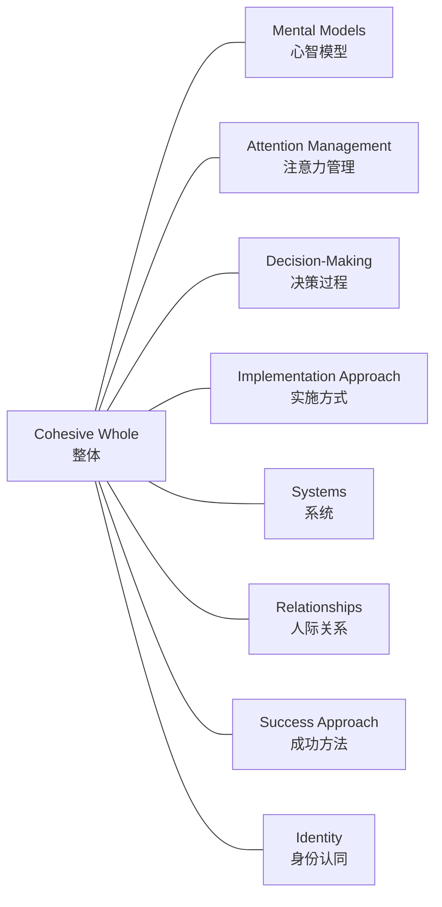
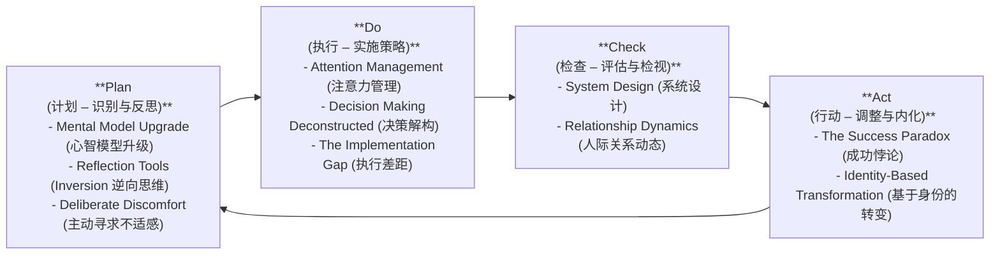
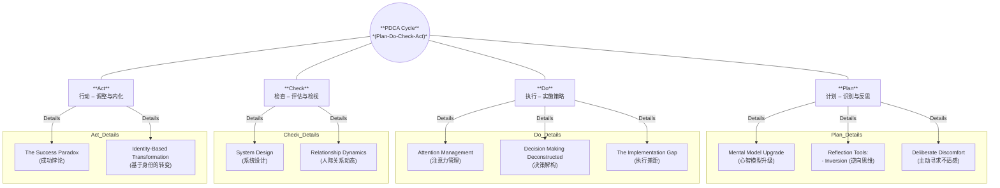
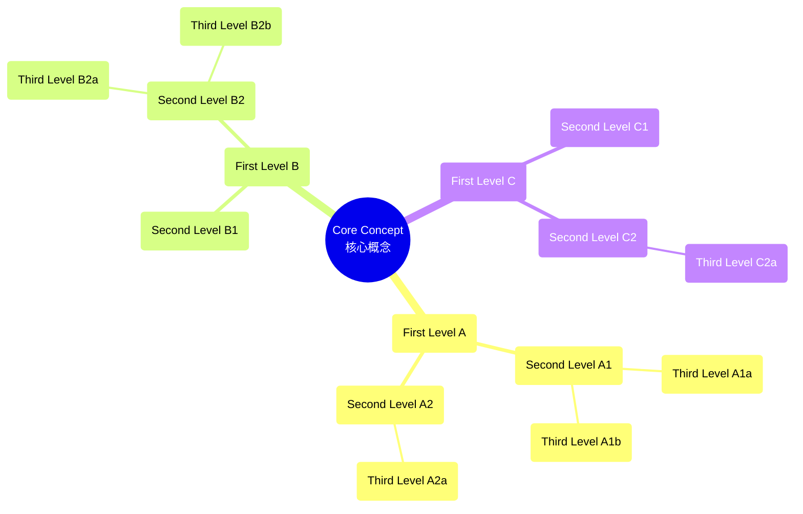
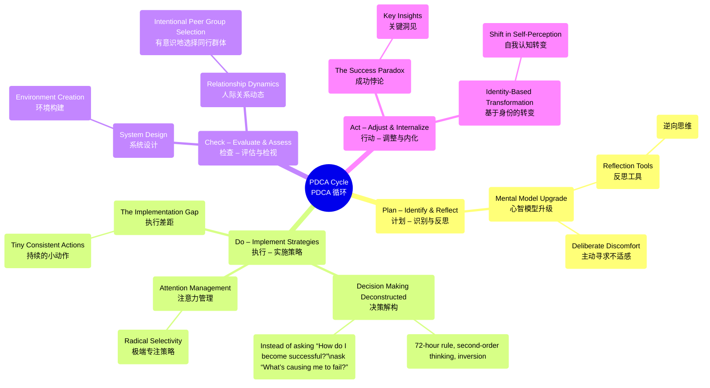
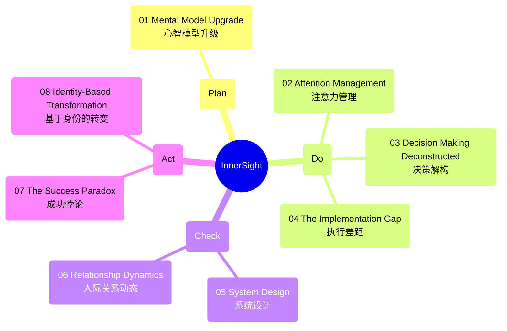

# Starting a Business

Welcome to the **Starting a Business** repository! This project contains documentation, resources, and step-by-step procedures for anyone looking to start a new venture—particularly a dog walking service, though the principles can apply to many types of small businesses.

---

## Project Overview

This repository is organized into **seven competencies** that guide you through the essential steps of launching a business:

1. **Entrepreneurial Profile** – Understand the traits and mindset required to be an entrepreneur.  
2. **Business Plan** – Draft a robust plan including your mission, vision, and business model.  
3. **Technological Tools** – Learn how to research information, use productivity software, and communicate effectively online.  
4. **Market Study** – Conduct primary and secondary research to understand your market, competition, and potential customers.  
5. **Marketing Products or Services** – Develop a value proposition, branding, and strategies for reaching your target audience.  
6. **Resource Planning** – Plan financials, operations, and resource allocation to run your business efficiently.  
7. **Starting and Managing a Business** – Understand the legal requirements, finalize your plan, and prepare for launch.

Each competency is explained in detail with goals, key concepts, exercises, and additional resources to help you build a successful small business from the ground up.

---

## Table of Contents

- [Repository Structure](#repository-structure)  
- [How to Use This Repository](#how-to-use-this-repository)  
- [Competencies](#competencies)  
  - [Competency 1: Entrepreneurial Profile](docs/competency1_entrepreneurial_profile.md)  
  - [Competency 2: Business Plan](docs/competency2_business_plan.md)  
  - [Competency 3: Technological Tools](docs/competency3_technological_tools.md)  
  - [Competency 4: Market Study](docs/competency4_market_study.md)  
  - [Competency 5: Marketing Products or Services](docs/competency5_marketing_products_or_services.md)  
  - [Competency 6: Resource Planning](docs/competency6_resource_planning.md)  
  - [Competency 7: Starting and Managing a Business](docs/competency7_starting_and_managing_a_business.md)  

---

## Repository Structure

```plaintext
starting-a-business/
├── README.md
├── LICENSE
├── docs/
│   ├── competency1_entrepreneurial_profile.md
│   ├── competency2_business_plan.md
│   ├── competency3_technological_tools.md
│   ├── competency4_market_study.md
│   ├── competency5_marketing_products_or_services.md
│   ├── competency6_resource_planning.md
│   └── competency7_starting_and_managing_a_business.md
└── assets/
    ├── competency1_tools.md
    ├── competency2_tools.md
    ├── competency3_tools.md
    ├── competency4_tools.md
    ├── competency5_tools.md
    ├── competency6_tools.md
    └── competency7_tools.md
```

### Repository Overview

This repository contains the following structure:

- **docs/** – Contains a Markdown file for each of the seven competencies.
- **assets/** – Holds images, slides, or other media referenced in the documentation.
- **README.md** – You’re reading it! This file provides an overview and guidance on how to use the repository.
- **LICENSE** – (Optional) Specifies the usage license for this content.

---

## How to Use This Repository

### Clone or Download the Repository

Clone the repository using Git:

```bash
git clone https://github.com/LixiaEchoTang/Starting-A-Business.git
```
Or download the ZIP file from GitHub and extract it locally.

### Explore the docs/ Folder

- Each competency has its own Markdown file.
- Start with **Competency 1** if you’re completely new to entrepreneurship.
- Follow the steps, read the goals, and complete the suggested exercises.

###  Refer to the assets/ Folder

- You’ll find slide images and any additional diagrams or visuals used throughout the documentation.
- Embed or view these images to supplement your learning.

###  Adapt the Material

- The competencies are designed to be a framework.
- Tailor them to fit your specific business idea, whether it’s a dog walking service or another small business concept.

###  Keep Learning

- Each competency includes further reading, links, and resources.
- Use them to deepen your understanding of entrepreneurship, marketing, finance, and more.

---

## Competencies

### Competency 1: Entrepreneurial Profile
Learn about the characteristics and mindset of successful entrepreneurs, self-assess your readiness, and confirm your decision to start a business.

### Competency 2: Business Plan
Draft your mission and vision, create a Business Model Canvas, and outline your value proposition for potential customer segments.

### Competency 3: Technological Tools
Discover how to research information online effectively, manage data in Word/Excel (or Google Docs/Sheets), and communicate with customers.

### Competency 4: Market Study
Conduct secondary and primary research on your market, learn about the PESTE framework, and analyze competitors.

### Competency 5: Marketing Products or Services
Develop a marketing strategy, plan prospecting activities, and refine your brand, sales pitch, and presentation skills.

### Competency 6: Resource Planning
Organize your business’s activities, outline material and financial resources, and draft financial statements to secure financing.

### Competency 7: Starting and Managing a Business
Learn about relevant laws and regulations, acquire necessary permits and licenses, and set up goals for the official start and ongoing management of your business.

---

## Happy Learning & Best of Luck!

We hope this repository helps you confidently plan, launch, and manage your new venture. If you have any questions or feedback, feel free to open an issue or reach out to us directly.

---


---



---



---



---


---



---
